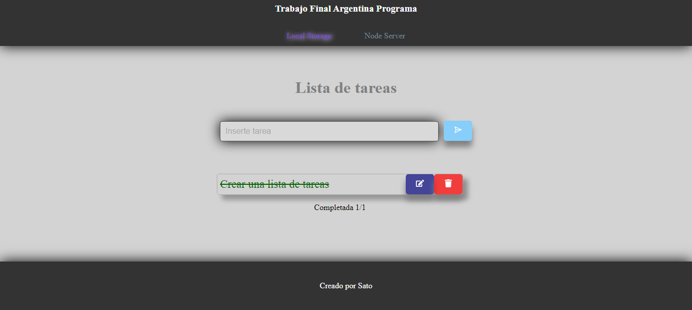

# To-Do List App (React + Server)

This is a simple To-Do List application built with React on the front end and Node.js serving as the backend. 
You have the option to use either the local storage version or the server versions of the app. The two server implementations re: a JSON server and a Node.js server, both configured to run on the same port.

## Features

- Add tasks to your to-do list.
- Edit existing tasks.
- Delete individual tasks.
- Delete all tasks (NOT available in the json server version).
- Store tasks either locally in your browser's localStorage or on a server.

## Usage

-Clone and install dependencies (For Front and back)
-Start either json server(dependency of the front folder, with db.json file already set up) 
or 
Node server.

Node server setup:
 .env
PORT=4001 =>matches the frontend url (can be changed)
CORS=http://localhost:5173 => url to allow CORS, choose port accordingly
DB_DATABASE= => db name
DB_DIALECT=mysql
DB_HOST=127.0.0.1
DB_PASSWORD=
DB_PORT=
DB_USERNAME= 
  Database: uses mySQL 
Create db (workbench or chosen app) and fill .env info accordingly

## Server Endpoints

- **GET /tasks**: Get all tasks.
- **GET /tasks/:id**: Get a specific task for editing.
- **POST /tasks**: Add a new task.
- **PUT /tasks/:id**: Update an existing task.
- **DELETE /tasks/:id**: Delete a specific task.
- **DELETE /tasks**: Delete all tasks (only available in the Node.js server version).

## Local Storage Version

By default, the app stores tasks in your browser's localStorage. This means your tasks will persist even if you refresh the page or close the browser. Note that tasks stored locally will be lost if you clear your browser's localStorage data.

## Server Version

To use the server version of the app, select the appropriate server implementation (JSON server or Node.js server) and start the server as described in the **Usage** section. Tasks will be stored on the server.

